# Linux-Strength-Training
## Linux Strength Training

### Guided room for beginners to learn/reinforce linux command line skills

### intro

deploy the machine by click start machine

### Finding your way around linux - overview

train u to learn how to deal with `find` command to find any file or dir based on its
filename
size
user/group
date modified
date accessed
Its keyword contents

---

- I have read and understood
  `no answer needed`

---

- What is the correct option for finding files based on group
  `-group`

---

- What is format for finding a file with the user named Francis and with a size of 52 kilobytes in the directory /home/francis/

first we should write the dir we wanna search in then use the `type` to say its a `file` and `-user` to grep the user files then `-size` to find the file with specific size
`find /home/francis -type f -user francis -size 52k`

---

- SSH as topson using his password topson. Go to the /home/topson/chatlogs directory and type the following: grep -iRl 'keyword'. What is the name of the file that you found using this command?
  first we ssh the ip
  `ssh topson@10.67.155.190`
  enter the password `topson`now we r in
  use the command `grep -iRl 'keyword'`
  and we got the file name
  `2019-10-11`
  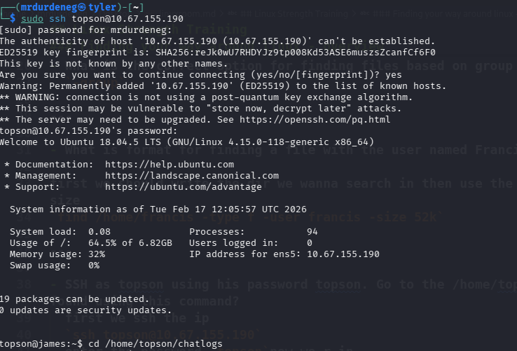
  

---

Type: less [filename] to open the file. Then, before anything, type / before typing: keyword followed by [ENTER]. Notice how that allowed us to search for the first instance of that word in the entire document. For much larger documents this can be useful and if there are many more instances of that word in the document, we would be able to hit enter again to find the next instance in the document

---

- What are the characters subsequent to the word you found?
  `less 2019-10-11`
  then write `"/keyword"`
  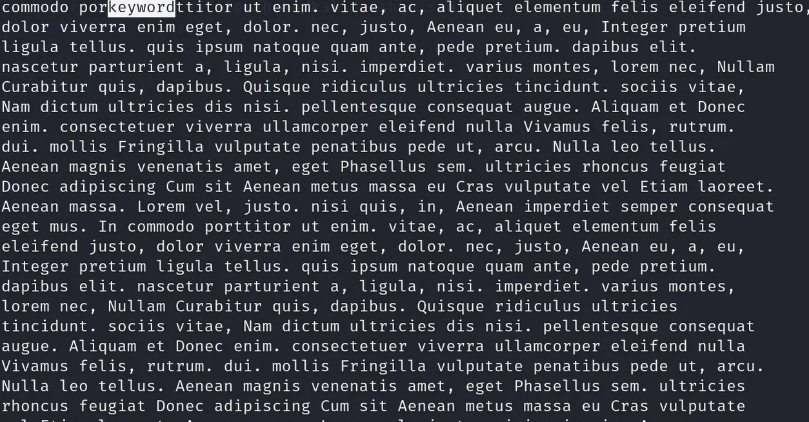
  the answer is
  `ttitor`

---

- Read the file named 'ReadMeIfStuck.txt'. What is the Flag?
  we can cat it
  `cat ReadMeIfStuck.txt`
  it direct us to another file
  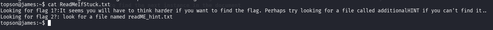
  so we need to find this file
  `find / -type f -name additionalHINT 2>/dev/null`
  then cat the file
  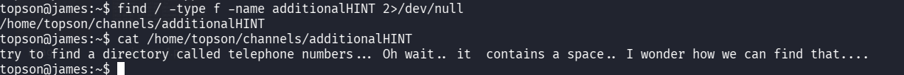
  we should search for this dir
  `find / -type d -name "telephone numbers" 2>/dev/null`
  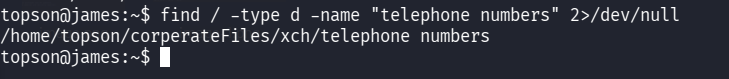
  get into the dir then see the content of it
  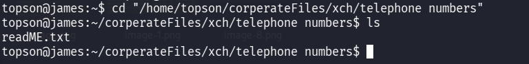
  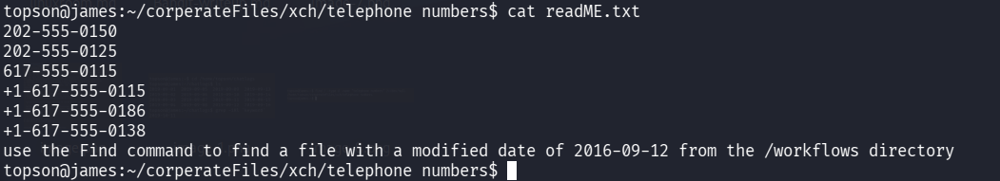
  we need to find this file `find /home/topson/workflows -type f -newermt 2016-09-11 ! -newermt 2016-09-13`
  
  now use `less` again then search for Flag
  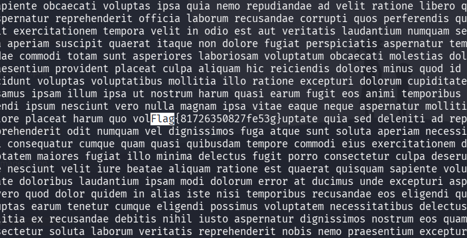
  we got ittt
  `Flag{81726350827fe53g}`

---

### Working with files

recap about working with files mv,cp,rename,create

---

- Hypothetically, you find yourself in a directory with many files and want to move all these files to the directory of /home/francis/logs. What is the correct command to do this?

`mv * /home/francis/logs`

---

- Hypothetically, you want to transfer a file from your /home/james/Desktop/ with the name script.py to the remote machine (192.168.10.5) directory of /home/john/scripts using the username of john. What would be the full command to do this?
  we use the `scp` command to upload file to a remote machine
  scp [filename] [username]@[IP of remote machine ]:/[directory to upload to]
  `scp /home/james/Desktop/script.py john@192.168.10.5:/home/john/scripts`

---

- How would you rename a folder named -logs to -newlogs
  the names have dashes in it so we need to put `--`
  make mv command
  `mv -- -logs -newlogs`

---

- How would you copy the file named encryption keys to the directory of /home/john/logs
  the name has spaces in it so we use quotes
  `cp "encryption keys" /home/john/logs`

---

- Find a file named readME_hint.txt inside topson's directory and read it. Using the instructions it gives you, get the second flag.

we continue what we start in the previous task
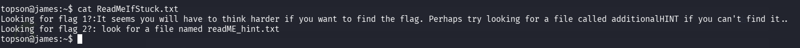
we search for `readME_hint.txt`
`find / -type f -name readME_hint.txt 2>/dev/null`
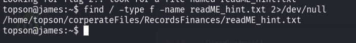
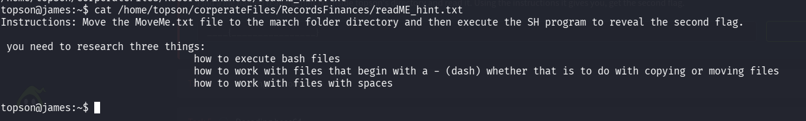
the file said the file name can have spaces or dashes in it so we need to search file with wildcard
`find / -type f -name "*MoveMe.txt" 2>/dev/null`
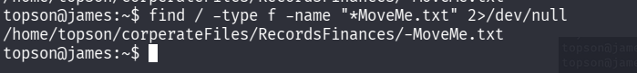
we move to this dir and see the content
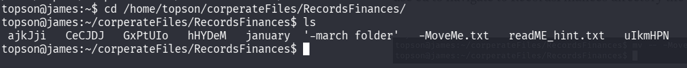
we found `'-march folder'   -MoveMe.txt `
so we need to move the file to the dir
`mv -- -MoveMe.txt '-march folder'/`
now we should run the bash file -runMe.sh by
`./-runME.sh` we got the flag
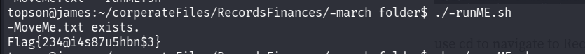
`Flag{234@i4s87u5hbn$3}`

---

### Hashing - introduction

first we should download the file
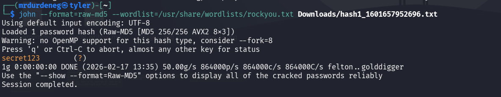
we found the password
`secret123`

---

- What is the hash type stored in the file hashA.txt
  ssh the ip first with
  username : sarah
  password : rainbowtree1230x
  `ssh sarah@10.65.159.171`
  we should search the file first `find / -type f -name hashA.txt 2>/dev/null`
  
  we found this hash `f9d4049dd6a4dc35d40e5265954b2a46`
  the type is `md4`

---

- Crack hashA.txt using john the ripper, what is the password?
  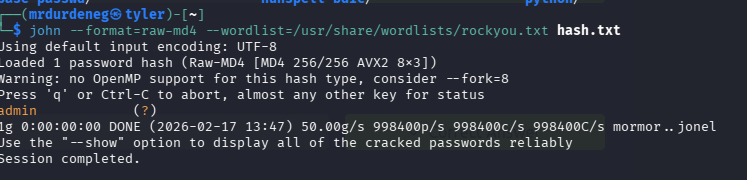
  we got `admin`

---

- What is the hash type stored in the file hashB.txt
  
  we found the hash we should know the type `b7a875fc1ea228b9061041b7cec4bd3c52ab3ce3`
  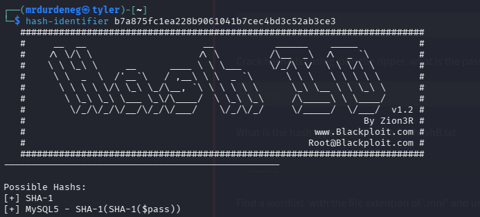
  `SHA-1`

---

- Find a wordlist with the file extention of '.mnf' and use it to crack the hash with the filename hashC.txt. What is the password?
  we find the hashC first
  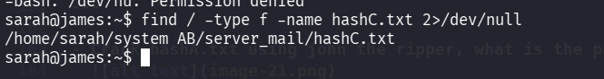
  we search for the .mnf file
  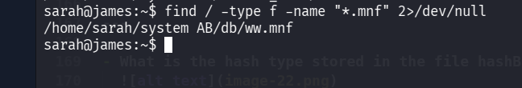
  know the hash type
  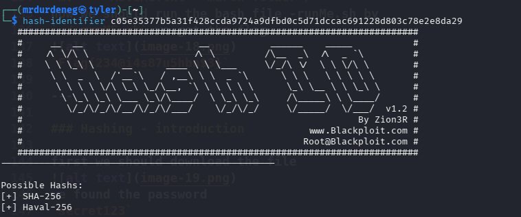
  i move the ww,mnf from the remote to my system
  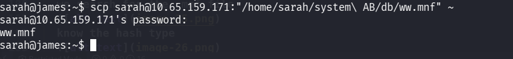
  `scp sarah@10.65.159.171:"/home/sarah/system\ AB/db/ww.mnf" ~`
  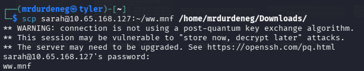
  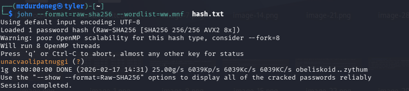

  `unacvaolipatnuggi`

---

- Crack hashB.txt using john the ripper, what is the password?
  `john --format=raw-sha1 --wordlist=/usr/share/wordlists/rockyou.txt hash.txt`
  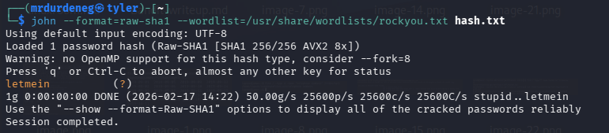
  `letmein`

---

### Decoding base64

- what is the name of the tool which allows us to decode base64 strings?
  `base64`

---

- find a file called encoded.txt. What is the special answer?
  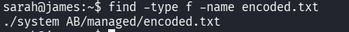
  we decode the file then search in it
  `cat /home/sarah/”system AB”/managed/encoded.txt | base64 -d > res.txt`
  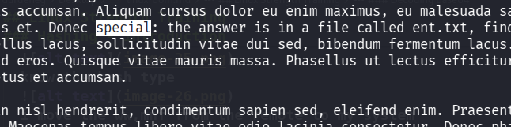
  we search for the file ent.txt
  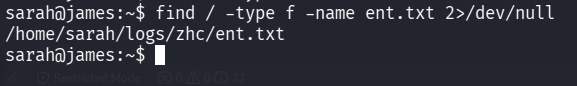
  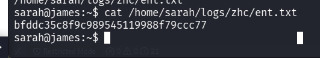
  we found this hash `bfddc35c8f9c989545119988f79ccc77`
  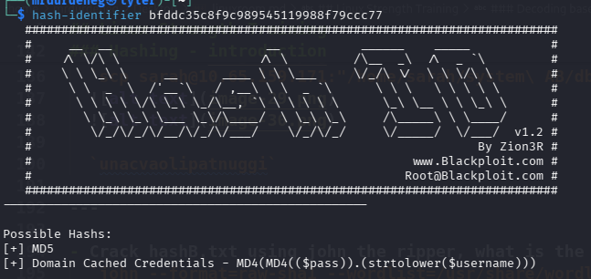
  i tried md5 but it is md4
  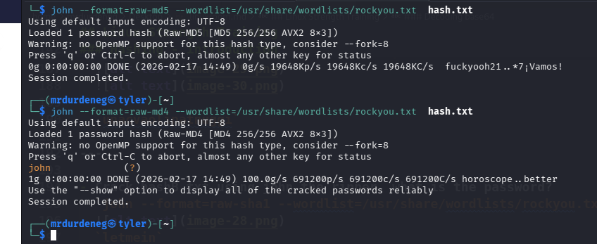
  the hash is `john`

---

### Encryption/Decryption using gpg

gpg --cipher-algo [encryption type] [encryption method] [file to encrypt]

---

- You wish to encrypt a file called history_logs.txt using the AES-128 scheme. What is the full command to do this?
  `gpg --cipher-algo aes-128 --symmetric history_logs.txt`

---

- What is the command to decrypt the file you just encrypted?
  gpg [encrypted file]
  `gpg history_logs.txt.gpg`

---

- Find an encrypted file called layer4.txt, its password is bob. Use this to locate the flag. What is the flag?
  first find the file
  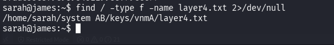
  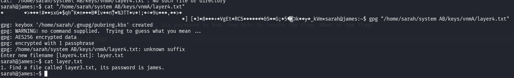
  we got a new file
  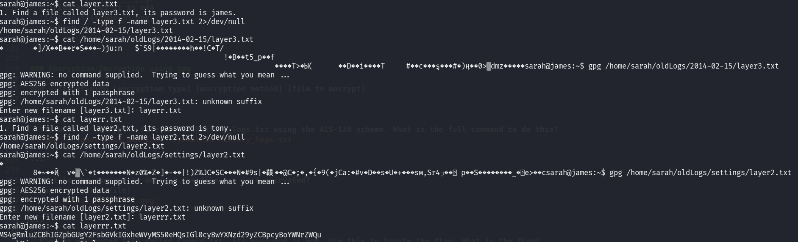
  WE KEEP GO FROM FILE TO ANOTHER TILL WE FOUND THE HASH
  `MS4gRmluZCBhIGZpbGUgY2FsbGVkIGxheWVyMS50eHQsIGl0cyBwYXNzd29yZCBpcyBoYWNrZWQu`
  when we base64 it it gives 1. Find a file called layer1.txt, its password is hacked.
  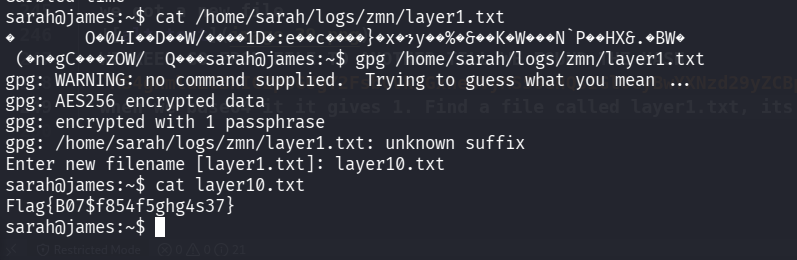
  we got the flag : `Flag{B07$f854f5ghg4s37}`

---

### Cracking encrypted gpg files

- Find an encrypted file called personal.txt.gpg and find a wordlist called data.txt. Use tac to reverse the wordlist before brute-forcing it against the encrypted file. What is the password to the encrypted file?
  find the files
  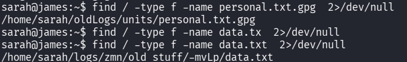
  copy the files to my machine
  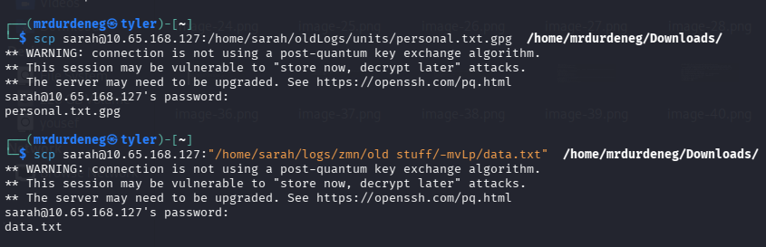

create hash from personal.txt.gpg

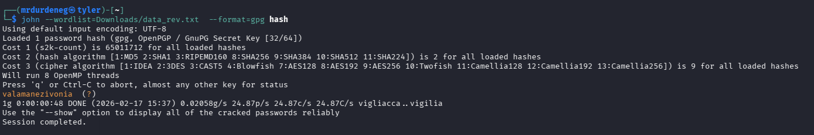
we got the password `valamanezivonia`

---

- What is written in this now decrypted file?
  `gpg --decrypt personal.txt.gpg`
  
  `getting stronger in linux`

---

### Reading SQL databases

- Find a file called employees.sql and read the SQL database. (Sarah and Sameer can log both into mysql using the password: password). Find the flag contained in one of the tables. What is the flag?
  first we search for the file then connect to the database
  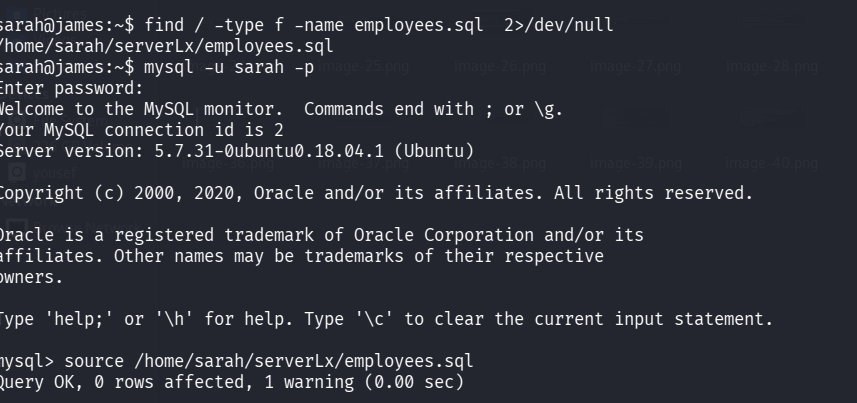
  use employees;
  show tables;
  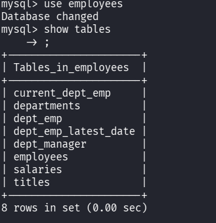
  describe the tables we found this
  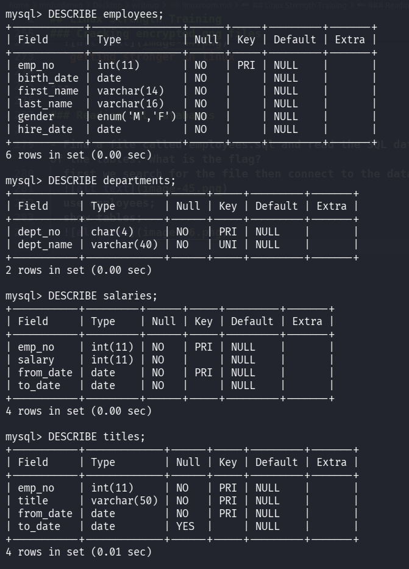
  we search in last_name cuz the length is like the answer
  `select * from employees where last_name like '%{%'; `
  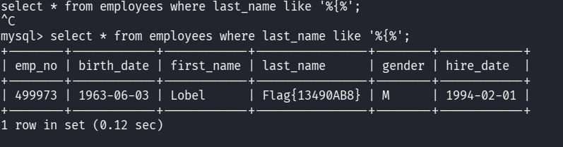

---

### Final Challenge

Go to the /home/shared/chatlogs directory and read the first chat log named: LpnQ. Use this to help you to proceed to the next task.
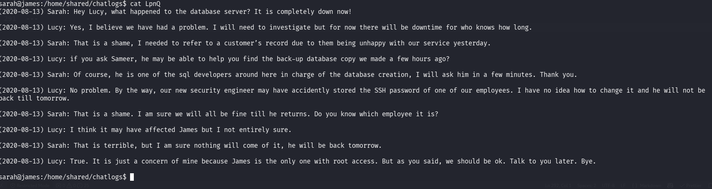
we should grep ssh word `grep -iRl "SSH"`
we got 2 files the previous one and another one
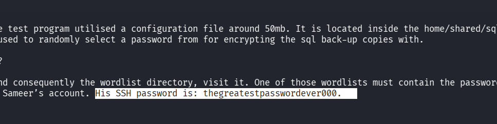
we got the password : `thegreatestpasswordever000

---

- What is the password for the sql database back-up copy
  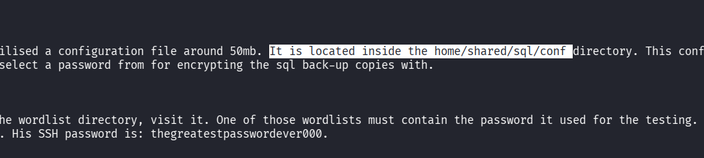
  get to the dir and grep the word
  `grep -iRl "back-up"`
  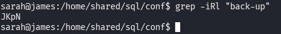
  when we cat the file we found a hash
  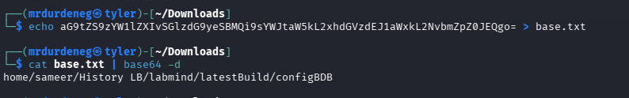
  it gave a path in sameer dir
  we ssh sameer with the password we got

we know that
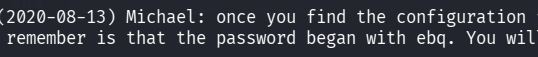
so we use `grep -iRl ebq "/home/sameer/History LB/labmind/latestBuild/configBDB/"`
we found 3 files
search in em
`grep -r "^ebq" "/home/sameer/History LB/labmind/latestBuild/configBDB/"`
after some tries the password is `ebqattle`

---

- Find the SSH password of the user James. What is the password?
  we go to /home/shared/sql as we told in the files
  we found the back up but in gpg type
  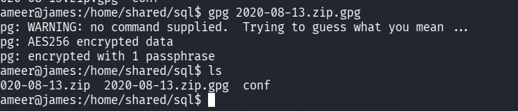
  unzip the file again
  open mysql by
  username : `sameer`
  password : `password`
  search for james `select * from employees where first_name like "james";`
  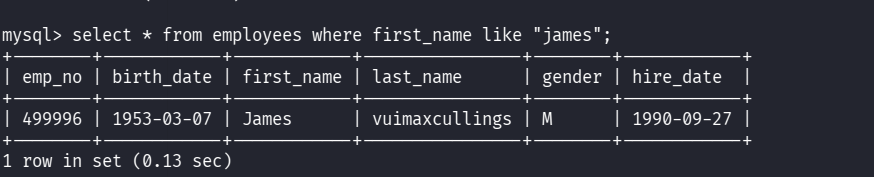
  password : `vuimaxcullings`

---

now ssh as james `ssh james@10.65.168.127`
switch to root `sudo su`
we found root.txt
`cat root.txt`
we got the flag : `Flag{6$8$hyJSJ3KDJ3881}`
NOW YOU ARE LINUX STRONGER!!!
